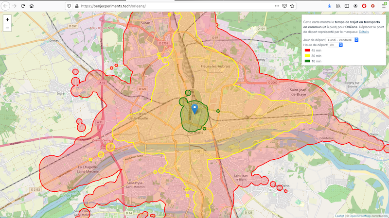

# gtfs-isochrone

create isochrone geojson from gtfs data

[view demo](https://benjexperiments.tech/orleans/)




# Usage

- locate a folder containing GTFS data as csv files. Required are:
    - stops.txt
    - calendar_dates.txt
    - trips.txt
    - stop_times.txt
    
```
git clone https://github.com/BenjaminHabert/gtfs-isochrone
cd gtfs-isochrone

# create python3 virtual environment
apt-get install build-essential python3-dev
python3 -m venv .venv
source .venv/bin/activate
pip install -r requirements.txt

# download and extract data
mkdir -p data/orleans/
curl https://data.orleans-metropole.fr/api/datasets/1.0/donnees-du-reseau-tao-au-format-gtfs/alternative_exports/export_gtfs_du_29_06_au_30_08_20_zip > data/orleans.zip
unzip data/orleans.zip -d data/orleans/

# prepare the data (required only once)
python run.py prepare data/orleans/

# run the development server
python run.py server data/orleans/

# get geojson from a query on http://localhost:9090/isochrone
# example of valid query with this dataset :
# -> http://localhost:9090/isochrone?lat=47.9007&lon=1.9036&duration=60&start=2020-07-02T13:00:00
```

# Deployment

Manual deployment on AWS EC2:

```
git checkout master
git pull
sudo ln -s /home/ubuntu/gtfs-isochrone/api.nginx.conf /etc/nginx/sites-available/apps/orleans-api.conf
sudo nginx -s reload
bash start_server.sh
```


# Notes


## Deployment notes


I use uwsgi to run the file `server.py` as explained [here](https://uwsgi-docs.readthedocs.io/en/latest/WSGIquickstart.html).

```
nohup uwsgi --socket 127.0.0.1:3031 --wsgi-file server.py --master --processes 3 > uwsgi.log &
```

I changed nginx configuration as follow (`/etc/nginx/site-available/default`):

```
server {


	location /gtfs-isochrone/ {
		# remove this part of the url
		rewrite ^/gtfs-isochrone(.*)$ $1 break;
		include uwsgi_params;
		uwsgi_pass 127.0.0.1:3031;
	}


    # ...
    # listen 443 ...
}
```


## initial pseudo-code algo

```
PREPARE
- add date to stoptimes using trips + calandar_dates
- walk time between all stops

INITIALIZE
- input: position, start-time, max duration -> end-time
- filter stoptimes between start-time and end-time
- filter: walk time too long
- all stops -> arrival time (walking); select where arrival < end-time

LOOP
- selected stop -> find stoptimes
    - end-time > trip-stoptime > arrival_time
- find trip:
    - first stoptime of same trip
- split stoptimes:
    - A: with selected trip, time >= first stoptime of trip
    - B: all others, kept for next loop
- from group A stoptimes:
    - drop duplicate stop: keep earliest
    - remove if > end-time
    - remove if later than existing stop (???)
- filter walk time
    - duration lower than maximum walk time possible (earliest stoptimes - end-time)
- walk from the new stops to all stops -> new arrival times
    - drop duplicate stop: keep earliest
    - remove if > end-time
    - remove if later than existing stop
- if empty: FINISHED
- else:
    - add to existing stops
    - restart loop


CONCLUDE
- we have list of (stop, shortest_arrival_time)
- create circle with walking distance for each
- add circle from start position
- merge all circles in a single shape
```
